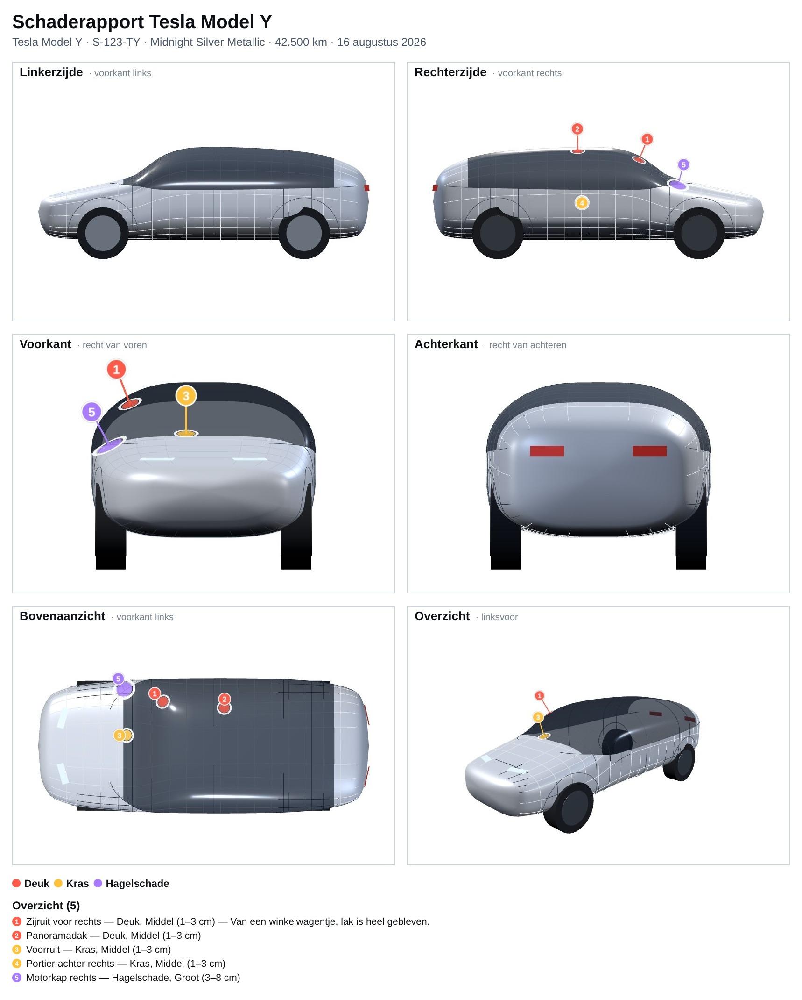

# Deukjes · Tesla Model Y

Een kleine web-app om samen de deukjes, krassen en lakschade van onze Tesla
Model Y vast te leggen. Je draait de auto met je vinger, tikt op de plek waar
de schade zit, en exporteert het geheel als **PDF** of **JPG** voor de
reparateur.



## Wat kan het

- **3D-model van de Model Y** — opgebouwd uit de echte maten (4,75 × 1,92 ×
  1,62 m, wielbasis 2,89 m), met panoramadak, ruiten, deurnaden en wielkasten
  als herkenningspunten.
- **Draaien met één vinger**, knijpen om te zoomen, twee vingers om te
  schuiven.
- **Tik = markering.** Elke markering krijgt automatisch de juiste
  paneelnaam ("Portier voor links", "Achterbumper rechts", "Panoramadak"…),
  die je zelf kunt aanpassen.
- **Soort en grootte** per plek: deuk, kras, lakschade, hagelschade, glas,
  velg of overig — klein, middel, groot of fors. Plus een vrije notitie.
- **Doorzichtig-knop** om ook de markeringen aan de andere kant te zien.
- **Exporteren**
  - PDF-rapport met zes aanzichten (links, rechts, voor, achter, boven en een
    3D-overzicht), genummerde markeringen en een tabel met plek, soort,
    grootte en notitie.
  - Dezelfde plaat als JPG, of alleen het huidige beeld als JPG.
- **Opslaan.** Alles wordt direct op het apparaat bewaard, dus je kunt de app
  gewoon sluiten. Daarnaast kun je een back-upbestand opslaan en openen om de
  markeringen op een ander apparaat (of bij elkaar) te krijgen.

In elk aanzicht worden alleen de markeringen getoond die van die kant ook
echt zichtbaar zijn, zodat een deuk op het rechterportier niet per ongeluk in
het linkeraanzicht opduikt.

## Gebruiken

De app heeft geen server en geen internet nodig — three.js en jsPDF zitten in
`app.bundle.js`.

- **Op de telefoon:** zet de map op een webserver (of GitHub Pages) en open de
  link. In Safari: Deel → *Zet op beginscherm* voor een app-icoon.
- **Op de laptop:** open `index.html` gewoon vanaf de schijf, dubbelklikken
  is genoeg.
- **Lokaal serveren** (handig bij ontwikkelen):

  ```bash
  npm start          # http://localhost:8080
  ```

## Ontwikkelen

De hele app staat in `src/app.js` (3D-model, interactie en export) en
`index.html` (opmaak). `app.bundle.js` is het resultaat van de build en staat
in de repo zodat de app zonder installatie werkt.

```bash
npm install
npm run build      # maakt app.bundle.js
npm run watch      # bouwt automatisch tijdens het sleutelen
```

De carrosserie is niet ingeladen als 3D-bestand maar wordt uitgerekend: vier
curven (daklijn, bodem, halve breedte en gordellijn) beschrijven het
zijaanzicht, en elke dwarsdoorsnede is een superellips die naar het dak toe
versmalt. Wil je de vorm bijstellen, dan zijn dat de tabellen `fTop`, `fBot`,
`fHalf` en `fBelt` bovenin `src/app.js`.

## Gegevens

Markeringen worden opgeslagen in `localStorage` onder de sleutel
`tesla-deukjes-v1`, als een lijst van punten in het assenstelsel van de auto
(x naar voren, y omhoog, z naar rechts) met de normaal van het oppervlak, het
soort schade, de grootte en de notitie. Diezelfde structuur zit in het
back-upbestand.
